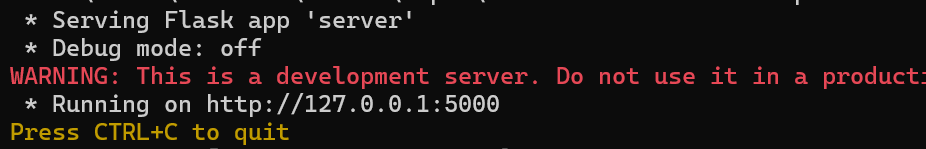
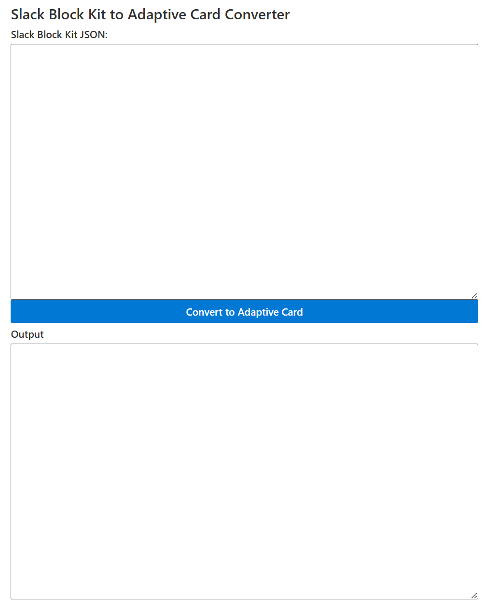
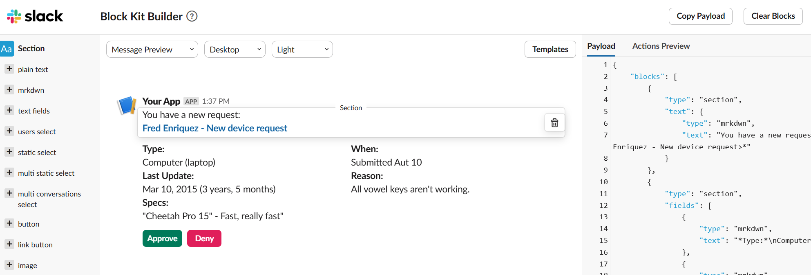
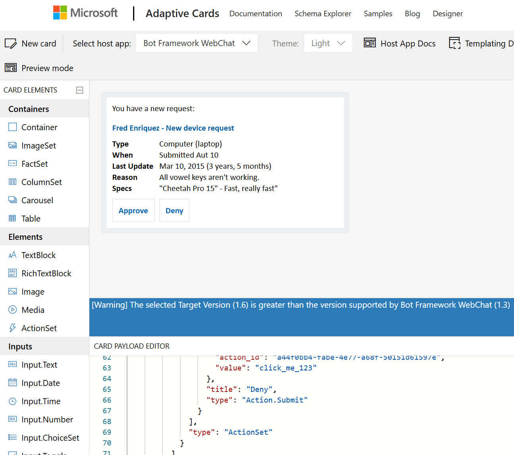

# Instructions to setup this project

### Description
This project contains two components:
1. Python server
2. React web app

You need to first run the Python script to start a web server.
Then run the react web app to open the UI that helps input Slack's block kit JSON and cover that into Microsoft's Adaptive card JSON.

## Run Python server

Navigate to /server folder in a terminal window.
You need below packages to run the script.

### `pip install flask`
### `pip install flask-cors`
### `pip install emoji`

To run the server:
### `py .\server.py`

## Build and Run React web app

Prep the project by installing the node modules required.
### `npm install`

You can start the web app now
### `npm start`

The web app opens [http://localhost:3000](http://localhost:3000) in the browser.

## How to use the web app

1. Go to Slack Block Kit Builder [https://app.slack.com/block-kit-builder/](https://app.slack.com/block-kit-builder/) in the browser. You will have to login with your Slack account.
2. Click the templates button to pick any of the templates. 

3. Now copy the JSON payload in the right side panel and paste that into the Slack Block Kit JSON text box. 
4. Click **Convert to Adaptive Card** button.
5. Copy the JSON from the Output text box.
6. Navigate to Adaptive Card designer [https://adaptivecards.io/designer/](https://adaptivecards.io/designer/) site.
7. Paste the JSON in the Card Payload Editor by replacing existing JSON.

# Disclaimer
Authors: Sathya Raveendran, Srinivas Varukala  
This project was created by Sathya Raveendran, with some modifications done by me. 

`This code is provided for the purpose of illustration only and is not intended to be used in a production environment.
THIS SAMPLE CODE AND ANY RELATED INFORMATION ARE PROVIDED "AS IS" WITHOUT WARRANTY OF ANY KIND, EITHER EXPRESSED OR IMPLIED,
INCLUDING BUT NOT LIMITED TO THE IMPLIED WARRANTIES OF MERCHANTABILITY AND/OR FITNESS FOR A PARTICULAR PURPOSE.
We grant You a nonexclusive, royalty-free right to use and modify the Sample Code and to reproduce and distribute the object code form of the Sample Code,
provided that You agree:  to not use Our name, logo, or trademarks to market Your software product in which the Sample Code is embedded;
(ii) to include a valid copyright notice on Your software product in which the Sample Code is embedded;
and (iii) to indemnify, hold harmless, and defend Us and Our suppliers from and against any claims or lawsuits, including attorneys’ fees,
that arise or result from the use or distribution of the this code`
